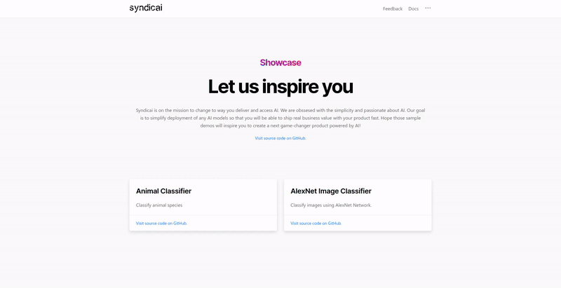

  
  
  

# Showcase
Showcase is the React web app created for the sample models deployed using [Syndicai Platform](https://syndicai.co). 

## Demo

## Project Status
Currenlty the project is under constant development. If you are willing to contribute, please [drop us a line](https://join.slack.com/t/syndicai/shared_invite/zt-eqbfjmyo-BCNw0gDryzU1A_6GH7xyYw) and help us spread the passion to applied AI!

## Run locally
1. Download or Fork the repository
2. Install necessary dependencies with `yarn` command.
3. Run the app in the development model using `yarn start`. Open http://localhost:3000 to view it in the browser.

## Technology
- [React](https://reactjs.org/)
- [TailwindCss](https://tailwindcss.com/)
- [Geist](https://react.geist-ui.dev/en-us/guide/introduction)

## Add new model
1. Create a new `your_model.js` file in the  `src/models` directory
2. Add your model to model list in `src/models/models.json` with necessary data
3. Add routing in `src/router/index.js`
